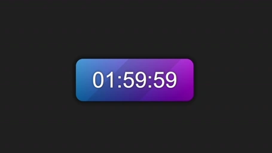
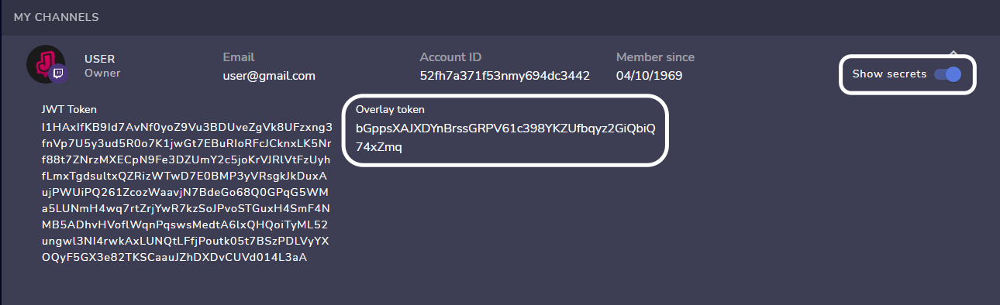

<h1 align="center">Improved Twitch Subathon Countdown</h1>

This is a Twitch Subathon Countdown originally by JayexDesigns.

The CSS Code is updated by Johnnycyan. The JS Files are updated by leabdd to add functionalities.

 

<h2>Description</h2>

A subathon timer that increases when someone subscribes, donates money, donates bits or purchases streamloots chests.

Added is a Timer that gets saved (in localStorage) and can be reset.

When you open the index.html you get to chose between "Reset" or "Start".

 

<h2>Shortcuts</h2>

To pause the Timer: CTRL+ALT+P

To enable/disable Happy Hour: CTRL+ALT+H

Shortcuts can be changed in config.js

 

<h2>Preview</h2>
<h3 align="center"></h3>
 

<h2>Usage</h2>

After cloning this repository you'll have to edit the "config.js" file with any plain text editor, then change the value of the variables according to what you want:

<h3>Twitch</h3>

To get your Subs and Bits you just have to add your Channel Name.

<h3>Streamlabs Token</h3>

To get the token you'll have to go to the API settings tab of your <a href="https://streamlabs.com/dashboard#/settings/api-settings">Streamlabs dashboard</a> then click on API Tokens, copy your socket API token and finally paste the code on the "streamlabs_token" variable in the "config.js" file.

<h3>StreamElements Token</h3>

To get the token you'll have to go to your <a href="https://streamelements.com/dashboard/account/channels">StreamElements channels dashboard</a>, then click on show secrets, copy the Overlay token and paste the code on the "streamelements_token" variable in the "config.js" file.

<h3>Streamloots Token</h3>

To get the token you'll have to go to your Streamloots creator dashboard, then to alerts & widgets, then go to alerts, then copy the last part of the alerts url and finally paste the code on the "streamloots_token" variable in the "config.js" file.

<h3>Initial Time</h3>

You can set the initial time of the timer by setting the hours, minutes and seconds to be added when the timer is created.

<h3>Happy Hour</h3>

If this is true, you can turn enable Happy Hour with the Shortcut. If it is false, the feature is disabled and cant be enabled.

You have to set the Happy Hour time values manually.

If enabled it can randomly activate the Happy Hour. It will last for one hour, but can be turned off manually with the Shortkey.

In the Config you can set a specific Date and Time. At that a Happy Hour will happen.

<h3>Bulk</h3>

This enables that multiple Subs get added to the timer at once.

For Example when a user gifts 10 Subs.

<h3>Full control on what to use</h3>

You can enable and disable if you want to add time for Subscriptions, Bits, Donations or Chests.

<h3>Other Values</h3>

Change the other values to set the amount of seconds that will be added for the subscriptions, donations... And the minimum donation amounts to trigger the countdown increase.

<h3>Add To OBS</h3>

To add it to OBS you just have to drag the "index.html" file to the sources section or add a browser source that points to the "index.html" file.

<h2>Known Problems</h2>
<p2>Only Streamelements Token in config.js does not add time for Subscriptions. Emulate with the Overlay Editor does work.

